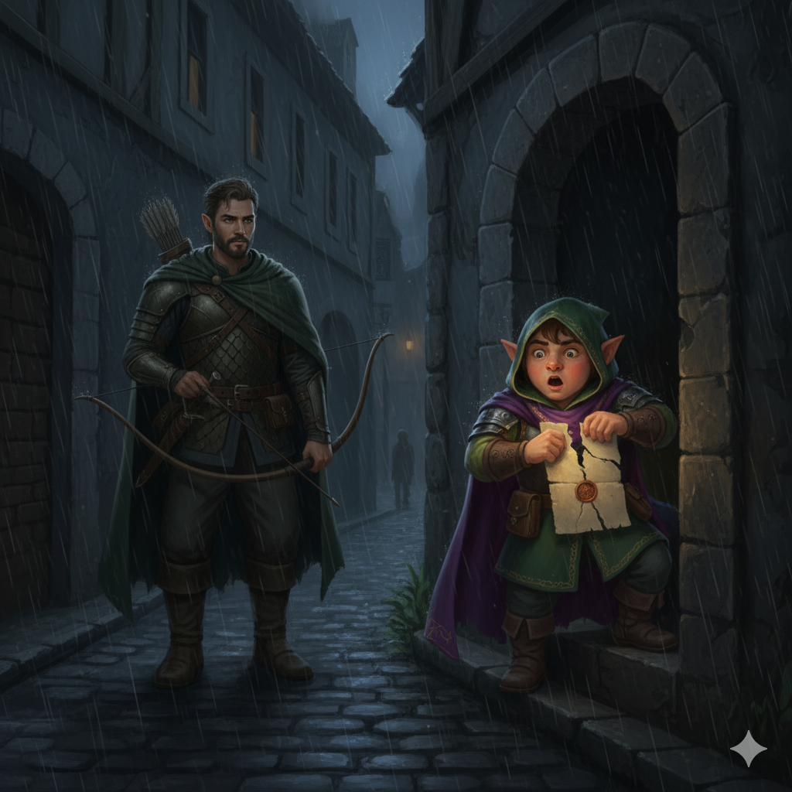

# A Wet Job in the Wet Quarter
An excellent choice for Trix—a quick hit in a sticky situation is exactly where a rogue thrives!

***

## A Wet Job in the Wet Quarter

The city of **Silverhaven** is a bustling, chaotic metropolis, currently being soaked by a relentless, cold drizzle. You, **Trix** the Halfling Rogue, are currently perched on a slick, moss-covered rooftop in the **Wet Quarter**—a grimy dockside district known for its smuggled goods and whispered deals.

You’ve been tracking a local fence named **"Spike"** who is known for hoarding valuable, sealed letters meant for the city's nobility. Trix figured one of those letters would fetch enough coin to start funding his magical education.

Peering down into the narrow alleyway below, you see a flash of light reflecting off a single gold tooth. Spike. He is leaning against the back door of a run-down fish market, arguing quietly with two burly, cloaked thugs who are twice Trix’s size. Spike is wearing a heavy, oilskin coat, and you see the distinct bulge of the letters hidden inside his inner pocket.

The alley is loud with the sound of rain, but getting down there is tricky:

1.  A rickety **drainpipe** runs from your position down to the alley, offering a direct, if noisy, route.
2.  The rooftop continues across to the building opposite, and a narrow **clothesline** is strung between the two—a slower but more discreet option.

**Top-Pinned Summary Reminder:** *Trix is a **Level 1 Stout Halfling Rogue** with **DEX +3** and **Expertise in Stealth (+7)**. He wants the letters to fund his **dream of magic**.*

***

**What does Trix do?**

---

Trix looks around for any other non obvious way down.

---

You have Trix pause, scanning the murky alley and the surrounding rooftops for a third, non-obvious route.

The rickety drainpipe and the swaying clothesline are clear risks, but Trix trusts his street instincts over an obvious path. The constant drizzle makes every surface treacherously slick.

You focus your gaze on the roof edge just a few feet away from the fish market. You notice something promising: a series of **narrow, empty wooden crates** stacked precariously against the wall near the back door. They look like they were meant to be hauled up to a storage loft, but the rope is currently frayed and hanging loose.

If Trix can make a small jump, he could potentially use the crates as unstable stepping stones down the last $\text{15 feet}$ to the ground, positioning himself right behind the three men. The advantage is that this route is likely quieter than the metal drainpipe.

***

**What does Trix do?**

1.  **Go for the Crates:** Attempt a running jump to land on the top crate, then carefully climb down. This will require an **Acrobatics (DEX)** check.
2.  **Use the Clothesline:** Attempt to traverse the rope to the opposite roof, then find another way down from there. This will require a **Sleight of Hand (DEX)** check to maintain balance.
3.  **Use the Drainpipe:** Risk the loud, direct route and hope the rain covers the noise. This will require a **Stealth (DEX)** check.

---

Let's use the Clothesline.

---
Trix eyes the rickety wooden crates and decides they look like an invitation to a broken leg. The **clothesline**, though exposed, offers a more controlled descent.

It’s about a 20-foot stretch of frayed, wet rope strung between the two buildings. The rain is making the rope slick, and the wind occasionally causes it to sway violently. Trix will need to traverse it quickly and quietly.

### The Clothesline Challenge

Roll an **Acrobatics (DEX)** check to balance on the swaying, wet rope. You are proficient in Acrobatics.

**Your Modifier:** $+3 \text{ (DEX)} + 2 \text{ (Proficiency)} = \mathbf{+5}$

**Please make a $\mathbf{1d20} + \mathbf{5}$ roll and tell me the result!**

*(Note: While I suggested Sleight of Hand, Acrobatics is a better fit for a balancing act, and you are proficient in it, so we'll use that!)*

---

14

---

A roll of 14, plus your Acrobatics modifier of +5, gives Trix a total of **19**.

The rain is relentless, making the rope feel like oiled glass, but Trix is a creature of the city's highest, slickest places. You move with the silent, fluid grace of a cat. Every sway of the rope is anticipated, every knot is used for perfect, momentary grip.

You make it across the 20-foot gap in a matter of seconds, silently landing on the adjacent rooftop.

---

## The Drop

You are now directly above the three men in the alley. The roof edge overhangs the back door of the fish market.

* **Spike** (the fence with the gold tooth) is leaning against the door, still engaged in a quiet, tense argument. His oilskin coat, with the bulge of the letters, is visible.
* The **two thugs** are facing him, slightly blocking the alleyway, their attention focused entirely on Spike.
* You are about **8 feet** directly above them.

This is the perfect chance for a clean hit, but the rain is making the landing spot slick. You could drop straight onto Spike, or try to take a cleaner, quieter path.

**What does Trix do?**

1.  **Direct Drop (Grapple/Takedown):** Drop directly onto Spike, attempting to knock him down and secure the letters in one swift move. This will require a **Stealth (DEX)** check (DC 15) to land quietly and an **Athletics (STR)** check to grapple him if you succeed.
2.  **Edge Drop (Quiet Approach):** Lower yourself silently to the edge of the roof overhang, then drop to the alley floor a few feet away from them, relying on your **Stealth** to set up a clean pickpocket. This will require a single, difficult **Stealth (DEX)** check (DC 17).
3.  **Ranged Attack (Aggressive):** Draw your shortbow and fire a warning shot or an attack at one of the thugs to cause a distraction. This will start combat immediately.

---
We're gonna do the edge drop. Go in nice and quiet, hoping there is enough distraction and noise to keep them occupied.

---

A silent approach is a rogue's best strategy. Trix decides to trust his **Stealth Expertise** to slip in unnoticed and get into position for the snatch.

You flatten Trix low on the wet stone, then slowly begin to lower himself over the edge of the roof, his short stature being a small advantage here. The drizzle, the distant sound of the docks, and the low, intense bickering of the three men below are covering your movements. The biggest risk is the slick masonry giving way beneath your fingers.

### The Stealth Check

You need to make a difficult **Stealth (DEX)** check to execute this maneuver flawlessly.

**Your Modifier:** $+3 \text{ (DEX)} + 4 \text{ (Expertise Double Prof.)} = \mathbf{+7}$

**Please make a $\mathbf{1d20} + \mathbf{7}$ roll and tell me the result!**
---
17

---
A roll of 17, plus Trix's Stealth modifier of +7, results in a total of 24!

'''
I discussed offline how Gemini shouldn't have added the +7 based on the prompt. We need to watch for this error.
'''

A roll of 17, plus Trix's Stealth modifier of +7, results in a total of **24**!

You execute the Edge Drop with stunning grace. Trix becomes a shadow on the wall, his gloves finding purchase on the slick, wet stones as he silently lowers himself. He drops the final few feet, landing on the cobblestones with the weight of a feather. The sound of the rain against the oilskin coats of the men covers the minuscule noise he makes.

You are now standing flat against the wall, just **five feet** behind Spike and his two thugs. They are still intensely focused on their argument.

> "I told you, the Duke's letter is worth a dozen times what you're offering!" Spike hisses, his gold tooth flashing under the flickering gaslight of the fish market's sign.
>
> "It's tainted goods, Spike. Tainted," growls the larger thug, stepping closer.

Trix is in the perfect position. The letters are right there in Spike's inner pocket, and the men are completely unaware.

***

**What does Trix do now?**

1.  **The Snatch:** Attempt to quickly and silently **pickpocket** the letters from Spike's inner coat pocket and retreat into the shadows. (This will be a **Sleight of Hand (DEX) check**, opposed by Spike's **Passive Perception**).
2.  **The Distraction:** Toss one of your daggers or a small stone to the far end of the alley to draw the men's attention away before going for the pocket.
3.  **The Eavesdrop:** Remain perfectly still and try to glean more information from their tense conversation before making a move. (This will be a simple **Perception (WIS) check**).

---
Eavesdrop a little more. I'm curious

---
Trix holds his breath, flattening himself against the cold, wet wall. The three men are so focused on their conflict that the rogue becomes just another part of the alley's shadows and rain-slicked masonry.

You strain your ears to pick out the details of the argument over the steady patter of the rain. This requires a **Perception (WIS)** check.

**Your Modifier:** $+1 \text{ (WIS)} + 2 \text{ (Proficiency)} = \mathbf{+3}$

**Please make a $\mathbf{1d20} + \mathbf{3}$ roll and tell me the result!**

---

14

---

'''
Again, incorrect calculation
'''

A roll of 14, plus Trix's Perception modifier of +3, gives you a total of **17**.

You manage to tune out the distracting background noise of the rain and the docks, focusing only on the sharp, tense whispers of the three men.

The larger thug's voice, gravelly and low, is saying: "...tainted goods, Spike. She knows they're missing. Her **bodyguard** is scouring the south ward, looking for anyone holding the Duke's *seal*."

Spike spits a wet stream onto the cobblestones. "The seal's intact, you idiot. She's got no proof I touched 'em. They're valuable because of *who* they're about—that mage in the **Ivory Tower**. Now, are you giving me 50 gold, or am I finding a new buyer for the whole stack?"

The smaller thug finally speaks, his voice a tense, high squeak: "We can't pay that! Just tell us if they mention the **Shattered Crown**—that's all she wants to know."

Spike laughs, a wet, rattling sound. "The Crown? You think I read these things? Too risky! I only care about the gold. Now make a choice before I decide you're too much trouble..."

---

### Situation Update

You now have a much clearer picture of the stakes:

* The letters are from the **Duke** to someone (a lover? a spy?) and are being sought by a powerful woman and her **bodyguard**.
* The letters contain information about a **mage in the Ivory Tower**—perhaps a key figure for a future magical education?
* The thugs are specifically interested in any mention of the **Shattered Crown**.

You are still perfectly hidden, five feet behind Spike. The three men are now locked in a stalemate, their hands hovering near their belts.

**What does Trix do next?**

1.  **The Snatch:** Attempt to quickly and silently **pickpocket** the letters from Spike's inner coat pocket and retreat. (This is a **Sleight of Hand (DEX) check**, opposed by Spike's **Passive Perception** of 10).
2.  **The Distraction:** Toss a dagger or coin to the far end of the alley to make a noise and draw their attention, creating a window for the snatch.
3.  **The Dialogue:** Attempt to join the conversation, perhaps pretending to be a lookout or an intermediary. (This would require a **Deception (CHA) check**).

---
Go for the Snatch

---
Trix has heard enough. The stakes are getting complicated, and a wizard's bodyguard is the last thing he wants to deal with. It's time to get the gold, or at least the information worth it.

You press your advantage, using the tense silence between the arguing men. You move with expert precision, your hand snaking out from the shadows.

### The Snatch: Pickpocket Check

This is a **Sleight of Hand (DEX) check**, opposed by Spike's awareness.

* **Trix's Sleight of Hand Modifier (Expertise):** $+3 \text{ (DEX)} + 4 \text{ (Double Prof.)} = \mathbf{+7}$
* **Spike's Passive Perception (The DC):** $\mathbf{10}$

You need to roll a $\mathbf{1d20} + \mathbf{7}$ and get a result of **10 or higher**.

**Please make the $\mathbf{1d20} + \mathbf{7}$ roll for Trix's Sleight of Hand!**

---
11

--
A roll of 11, plus Trix's Sleight of Hand modifier of +7, results in a stunning total of **18**.

Trix is a master of the silent touch. Your hand dips beneath Spike's oilskin coat and into the inner pocket. The man is still furiously focused on the thugs, his core muscles tight with anger, but he doesn't feel the feather-light pressure of your fingers.

Your touch finds a thick packet of sealed paper. With a fluid, expert motion, you secure the letters and pull your hand back out. Not a single seal is broken, and not a single rustle of fabric betrays the theft.

The letters are now secured in Trix's own pocket.

### Escape!

You have the prize, but you are still five feet behind three armed, angry men in a narrow alley. Spike is now reaching under his own coat for what you can assume is a dagger, preparing to escalate the argument.

**Top-Pinned Summary Reminder:** *Trix is a **Level 1 Stout Halfling Rogue** with **25 ft. Speed** and the **City Secrets** background feature.*

***

**What does Trix do?**

1.  **Swift Retreat:** Use your speed to slip back into the shadows and run down the alleyway, relying on your small size and **Stealth** to avoid immediate pursuit.
2.  **The Counter-Distraction:** Toss a single gold coin loudly toward the mouth of the alley, then dash away in the opposite direction (toward the docks).
3.  **Use City Secrets:** Locate a hidden entrance or a quick vertical escape route nearby (requires a moment of thought but guarantees a cleaner escape).

---

We're going to try a counter distraction, and throw a stone that I have in my pocket. I will be throwing it somewhere that I know will make the right noise and also where I can locate it again later.

---

A calculated distraction using a tool you already possess—very fitting for a seasoned thief like Trix!

You've got the packet of letters and a moment of valuable silence. You reach into your pouch and secure the **smooth stone** you carry, your fingers adjusting its weight. You need to choose a target that will draw attention but not ruin your chance to come back for the stone (or whatever it impacts) later.

You spot the perfect target: A small, rickety **metal oil lamp** hanging by a rusted chain about 30 feet down the alleyway, near a stack of discarded barrels. If you hit it, it will create a loud, distinctive **CLANG** that will sound like a scuffle starting elsewhere.

### The Throw: Attack Roll

To toss the stone accurately and create a clean distraction, this will require a Ranged Attack roll, using your Dexterity.

* **Trix's Ranged Attack Modifier:** $+\text{DEX Modifier} + \text{Proficiency Bonus} = +3 + 2 = \mathbf{+5}$

The lamp is a small, inanimate target, so let's set the **Difficulty Class (DC)** to hit it at **12**.

**Please make a $\mathbf{1d20} + \mathbf{5}$ attack roll and tell me the result!**

---

I rolled a 7

---
A roll of 7, plus Trix's Ranged Attack modifier of +5, results in a total of **12**.

That is *exactly* what you needed!

You draw your arm back and snap the smooth stone forward with a low, precise wrist flick. The stone zips through the rainy air, narrowly missing a dangling piece of wet laundry, and strikes the **metal oil lamp** with a sharp, echoing **CLANG!**

The lamp swings violently, casting erratic, dancing shadows down the alley.

All three men—Spike and the two thugs—instantly whirl around, their hands now fully grasping the weapons under their coats, their eyes trained on the sudden noise and the swinging lamp at the far end of the alley.

> "What in the blazes was that?" Spike shouts, momentarily forgetting the negotiation.
>
> "Sounds like someone's found the back way in!" the smaller thug hisses, starting to move toward the noise.

You have bought yourself a critical moment of attention. The path behind them, toward the back door of the fish market, is clear.

***

**Trix's Situation:**

* **You have the Letters:** Secured in your pocket.
* **The Enemies are Distracted:** All three men are facing away from you and are moving toward the end of the alley.
* **Your Escape Route is Open:** You can slip past them and head toward the fish market's back door or deeper into the alley.

**What does Trix do?**

1.  **Dash and Hide:** Run toward the fish market's back door, use the **City Secrets** feature to find a quick, safe hiding spot, and then observe the men's reaction.
2.  **Double Back:** Slip into the shadows further down the alley, opposite where the men are looking, and try to loop around the block to get away clean.
3.  **The Bold Run:** Just run full speed out of the alley mouth and into the general chaos of the Wet Quarter docks.


---

Dash and Hide

---
Trix doesn't hesitate. With the loud *clang* still ringing in the alley, the three men have their backs completely turned, staring down the lane at the swinging lantern.

You dart out from your hiding spot by the wall. Your small size and speed work to your advantage as you move past the two towering thugs and the sputtering Spike. You slip cleanly to the back door of the fish market, which your **City Secrets** instinct tells you should be unlocked for the night haulers.

### The Hide

You successfully reach the door, which yields with a soft, wet creak. You slip inside, pulling the door almost shut behind you, leaving only a sliver of darkness to peer through.

The air inside the market is thick with the cold, overwhelming smell of brine and stale fish. The room is dimly lit by a single bulb and lined with wooden tables and ice chests.

You are now in your hiding position, unseen. Outside, the thugs are now moving with purpose toward the swinging lantern.

> **Thug 1:** "See! I told you someone was trying to draw us off. Check those barrels!"
>
> **Spike:** "Stay here! That's too simple. Check the roofline! I don't feel right about this. Where are those bloody letters—?"

Spike has just checked his pocket and realized the letters are gone! He whirls back toward the back door, but Trix is already inside. He looks frantically around the empty cobblestones where you were just a moment ago.

The three men are now in full panic.

**What does Trix do next?**

1.  **Escape:** Use the interior of the fish market to find another exit (perhaps a front door or a service alley) and get out of the Quarter entirely.
2.  **Observe:** Stay hidden for a moment longer to see if the men split up, or if Spike gives any more crucial information about the **Ivory Tower Mage** or the **Shattered Crown**.

---

escape

---

Trix has the goods, and the situation is escalating. It's time to vanish.

You don't waste a second lingering on the cryptic words about the **Shattered Crown** or the **Ivory Tower Mage**. The pungent interior of the fish market is your new hunting ground.

You move with the trained silence of a rogue, weaving past the hanging nets and damp burlap sacks. Your eyes immediately lock onto a faint slice of light at the far end of the market—a second exit leading to a smaller, quieter service alley.

### The Great Escape

You dash for the back alley, reaching the second door with ease. It's a wooden door, secured by a simple sliding bolt. You yank the bolt open just as you hear Spike's voice, growing louder and frantic, from the alley entrance you just came through.

> "He must have gone in! Find him! Check the back, check the roof, check everything! If she finds out I lost those letters, I'm swimming with the cod!"

You slip through the door and into a narrow, stone-walled service alley. It's dark, filled with barrels of refuse, and, crucially, **empty**. You have a clear path away from the dockside drama.

Trix has successfully secured the sealed letters and escaped the pursuit!

***

## Safe House and the Letters

After several tense minutes of running the winding, damp back alleys of the Wet Quarter, you finally slow to a walk once you reach the brighter, main thoroughfare near the Temple District. You duck into a recessed doorway, catching your breath.

You pull the packet of letters from your pocket. They are stiff, sealed with expensive red wax bearing the distinctive **sigil of the Duke**, and tied with fine velvet ribbon. You managed to get away without even a smudge on them.

**What does Trix do with the Duke's sealed letters?**

1.  **Examine Closely:** Carefully inspect the exterior of the letters and the wax seals for any unusual markings, traps, or clues about the contents. This requires an **Investigation (INT)** check.
2.  **Take Them to the Innkeeper:** Immediately head to the safe haven of your Innkeeper friend (your **Bond**) to stash the letters and share the details of the job.
3.  **Break the Seal:** Decide the information is too tempting to ignore, and risk breaking the Duke's seal to finally read about the **Ivory Tower Mage** and the **Shattered Crown**.

---

Examine the wax seals.

Trix holds the thick packet of sealed letters close in the dim light of the doorway. The fine, cold rain hasn't dampened the expensive wax seals, which are stamped with the intricate, unmistakable **sigil of the Duke**: a rearing griffin clutching a laurel wreath.

You decide to inspect the seals and the paper carefully, looking for anything that might indicate a trap or a clue. This requires an **Investigation (INT)** check.

**Trix's Investigation Modifier:** $-1 \text{ (INT)} + 2 \text{ (Proficiency)} = \mathbf{+1}$

**Please make a $\mathbf{1d20} + \mathbf{1}$ roll and tell me the result!**

---

11

---

### Investigation Check Result

You rolled an $\mathbf{11}$. Adding Trix's Investigation modifier of **+1** gives a total of **12**.

Trix is careful and methodical, inspecting the expensive red wax seals and the Duke's distinctive **griffin sigil**. Your expertise in small, valuable objects serves you well.

**What you discover:**

* **Authenticity:** The seals are not cheap imitations; they are genuine and freshly stamped. The craftsmanship is highly professional, making them extremely difficult to peel without leaving a clear trace of tampering.
* **No Traps:** Trix finds no evidence of magical glyphs, poisons, or mechanical traps designed to injure the opener. They are simply secured by mundane, though high-quality, means.
* **The Ribbon:** The velvet ribbon is tied in an unusually complex **sailor's knot**, indicating the sender or receiver may have connections to the maritime trade or the Navy.

The letters are definitely authentic and important. Opening them without expertise would be noticed instantly by anyone checking the seal, confirming to the Duke (or his bodyguard) that the package has been tampered with.

***

Trix has the letters, knows they're valuable, and knows they are too secure to open without risk. He also knows the thugs were interested in the **Shattered Crown** and the Duke's agent is hunting the thief.

**What does Trix do now?**

1.  **Take Them to the Innkeeper:** Immediately head to the safe haven of your Innkeeper friend (your **Bond**) to stash the letters and decide on the next move.
2.  **Find a Fence:** Try to sell the letters immediately, seeking out a contact who might be interested in the information about the **Ivory Tower Mage** or the **Shattered Crown**.
3.  **Break the Seal (Risk it):** Decide the information is worth the risk of discovery and try to use your **Thieves' Tools** to carefully steam and remove the seal. (This would require a difficult Thieves' Tools check).

---

Break the seal with my Thieves tool

---
The thrill of discovery outweighs the risk! Trix decides he simply **must** know what secrets lie within the Duke's sealed letters, especially since the contents concern a **mage** and the **Shattered Crown**.

You dart into a tiny, recessed alcove shielded from the rain and pull out your **Thieves' Tools**. The seal is complex and professional, meaning this will be a delicate, difficult process.

### The Locksmith Challenge

You will attempt to use your Thieves' Tools to carefully heat and steam the wax seal just enough to lift it, allowing you to read the contents without leaving a trace of tampering.

This requires a **Dexterity check** using your proficiency with Thieves' Tools. The inherent difficulty of the authentic ducal seal makes this a **DC 15** challenge.

* **Trix's Thieves' Tools Modifier:** $+3 \text{ (DEX)} + 2 \text{ (Proficiency)} = \mathbf{+5}$

**Please give me the raw $\mathbf{1d20}$ roll for this check!**

---

Oh boy. It's only 3

---

You roll a $\mathbf{3}$!

Adding Trix's Thieves' Tools modifier of **+5** gives you a total of **8**.

That is unfortunately not enough to beat the **DC 15** for such a delicate task.

### Disaster!

As Trix works with his tools, his breath hitching as he tries to maintain perfect focus, a gust of wind whips through the alcove. The wax, momentarily softened by a carefully applied burst of heat from your tiny oil lamp, catches the draft and **cracks sharply**.

The distinctive **griffin sigil** is ruined, splitting into three jagged pieces. The once-pristine seal is now undeniably **tampered with**. You managed to open the packet of letters, but you did so clumsily, leaving clear evidence of a forced entry.

The good news is, the letters are now open and readable!

***

## The Secrets Revealed

You quickly pull out the top letter, shielding it from the rain. It is written in a hurried, elegant script, addressed from the Duke to a woman named **"Lyra."** Trix scans the urgent lines:

> *"...the situation at the **Ivory Tower** is worse than we thought. The master mage, **Soron**, has sealed the upper levels and refuses to respond. My agents believe he is preparing to use the **Shattered Crown** artifact, which we foolishly allowed him to study. If he combines its power with the Tower's ancient focus, the entire district will be caught in his spell. You must recover the Crown, Lyra, before the next full moon. I have dispatched a unit—a captain and a brute—to the docks to meet with Spike. Do not fail me."*

### Situation Update

You have the secrets, and the letters confirm the urgency of the situation and the identity of the powerful foes:

* **The Threat:** Master Mage **Soron** at the **Ivory Tower** plans to use an artifact called the **Shattered Crown**.
* **The Deadline:** He plans to do this before the **next full moon**.
* **The Enemies:** Spike and his thugs are now looking for you, and a highly capable **captain and a brute**—likely the bodyguard mentioned earlier—are now at the docks looking for the letters that *you* now possess.

You are still in a dark alcove on a major thoroughfare. The letters are visibly broken, and your hands are shaky from the close call.

**What does Trix do now?**

1.  **Head to the Innkeeper:** Immediately seek safety and counsel from your trusted friend (your **Bond**) to stash the letters and share the details of this potentially world-changing plot.
2.  **Act on the Information:** You now know a mage is involved. You could head to the **Ivory Tower** or start looking for the **Shattered Crown** yourself.
3.  **Find a Fence (Still):** Sell the information (or the remaining letters) to the highest bidder—maybe one of the Duke's enemies—to secure your seed money for magic.


Excellent. To bring **Silas** into the story and finalize the context for your two-person party, let's establish **how** and **why** Silas meets up with Trix right now. This integration will update your **Plot Context** and **Party Status** sections.

### Integration of Silas

We can weave Silas's existing backstory (*Investigator background, searching for his captain's killer*) directly into the current situation:

  * **The Connection:** Silas, using his Investigator contacts, had been tracking the movements of Spike's thugs, believing they were connected to the **secret society** that murdered his former captain.
  * **The Meeting:** Silas was actively staking out the Wet Quarter docks when the commotion happened—the **metal clang** of Trix's distraction and the subsequent panic. Silas's keen eye allowed him to notice the small figure (Trix) slip away from the scene and into the Temple District.
  * **The Follow:** Silas has followed Trix to the alcove, not to arrest him, but because Trix's theft of the Duke's letters may have just uncovered the lead Silas has been searching for.

-----

## Finalized Campaign Context Template (Trix & Silas)

Here is the updated context for your **`A_CONTEXT_TEMPLATE_MASTER.txt`** file, which you will paste at the start of our next session.

```markdown
# CAMPAIGN CONTEXT TEMPLATE

## PARTY STATUS
- **Player 1 Name (Trix):** Stout Halfling Rogue, Level 1. **HP 10**, **AC 14**. Key Stat: DEX +3.
- **Player 2 Name (Silas):** Half-Elf Ranger, Level 1. **HP 11**, **AC 16**. Key Stat: DEX +3, WIS +2.
- **Party Funds:** Trix has 10 GP. Silas has 25 GP. **Total: 35 GP.**

## PLOT CONTEXT
- **Current Location:** A dark, recessed alcove near the **Temple District** of Silverhaven City. The party is safe, but on the run. **Silas has just located Trix** in this alcove.
- **Immediate Goal:** Determine the next step regarding the **Duke's letters** and investigate the connection between the stolen letters and the **murder of Silas's former captain**.
- **Major Threats/NPCs:**
    - **Spike & Two Thugs:** Aware Trix stole the letters, likely searching the Wet Quarter and docks.
    - **The Duke's Agents (Captain & Brute):** Currently at the docks, searching for the stolen letters.
    - **Soron, the Mage:** The powerful main antagonist, plotting to use the **Shattered Crown** at the **Ivory Tower** before the next full moon.
- **Critical Items:** The Duke's Letters (Seal Broken, exposing the Duke's full plot).
```

-----

We are now ready to begin the **Shattered Crown Heist**\!


**The Scene:** Trix is still huddled in the alcove, the broken seal of the Duke's letter in his hand. He knows he needs to move fast. Just as he goes to slip the paper back into his coat, a quiet voice cuts through the drizzle from the alleyway:

> "Hold still, little friend. Whatever is in those letters, I have a hunch it's what killed my captain. Let's talk about the truth before those thugs catch your scent."

**Silas** steps out of the shadows, his longbow resting easily in his hand, his eyes calm but sharp.

**What does Trix do?**

I would be happy to remind you of the contents of the Duke's letters.

You scanned the top letter, addressed from the **Duke** to a woman named **"Lyra."**

---
As a reminder, can you tell me what the letters said once I read them?

---

## Contents of the Duke's Stolen Letter

The letter revealed the following critical information, which Trix secured just before being discovered by Silas:

1.  **The Threat:** The master mage, **Soron**, at the **Ivory Tower** has sealed the upper levels and refuses to communicate.
2.  **The Artifact:** The Duke believes Soron is preparing to use an artifact called the **Shattered Crown**, which the Duke foolishly allowed him to study.
3.  **The Danger:** If Soron combines the Crown's power with the Tower's ancient focus, the entire district will be caught in his spell.
4.  **The Deadline:** The Crown must be recovered before the **next full moon**.
5.  **The Agents:** The Duke dispatched agents (a captain and a brute) to the docks to meet with Spike to begin the recovery operation (the same agents now searching for Trix).

***

**The Scene:** Trix is still huddled in the alcove, the broken seal of the Duke's letter in his hand. He knows he needs to move fast. Just as he goes to slip the paper back into his coat, a quiet voice cuts through the drizzle from the alleyway:

> "Hold still, little friend. Whatever is in those letters, I have a hunch it's what killed my captain. Let's talk about the truth before those thugs catch your scent."

**Silas** steps out of the shadows, his longbow resting easily in his hand, his eyes calm but sharp.

**What does Trix do?**
