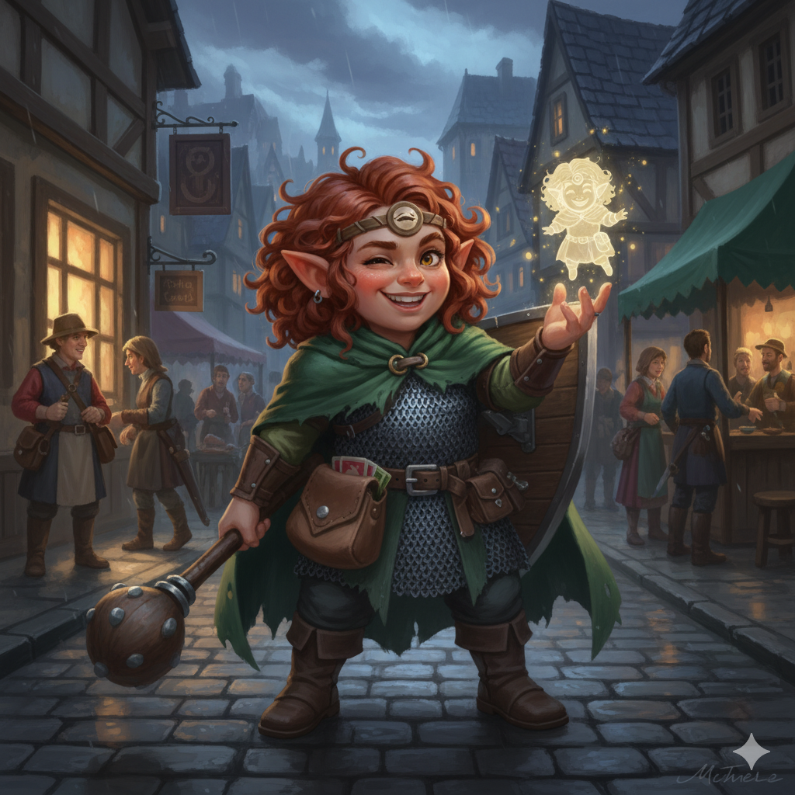

## Fimble: The Mischievous Healer (Level 1 Forest Gnome)

### Summary & Context

| Context Element | Details |
| :--- | :--- |
| **Character Name** | **Fimble** |
| **Race/Class** | **Forest Gnome Cleric (Trickery Domain) (Level 1)** |
| **Alignment** | **Chaotic Good** |
| **Diety** | **Olidammara (The Laughing Rogue)** |
| **Role** | Primary Healer, Support Caster, and Social Trickster. |
| **Motivation** | Seeking trouble and mischief, believing that well-timed tricks and illusions can serve a greater, benevolent good. |

---

### The Basics & Personality

| Category | Detail |
| :--- | :--- |
| **Class Feature** | **Channel Divinity: Invoke Duplicity.** As an action, Fimble creates an illusionary, perfect duplicate of herself. She can cast spells as if she were in the duplicate's space. **Spellcasting:** Uses **Wisdom** for powerful healing magic. |
| **Race Feature** | **Gnome Cunning:** Advantage on all Intelligence, Wisdom, and Charisma saving throws against magic. **Minor Illusion:** Can cast the *Minor Illusion* cantrip (perfect for pranks!). |
| **Background Feature** | **False Identity (Charlatan):** Fimble has created a secondary persona, complete with a ready-made disguise and set of contacts, which she can use to gather information. |
| **Personality Trait**| I can't resist a good practical joke, even if it delays my objective. The best way to cheer someone up is a well-timed, harmless prank. |
| **Ideal** | **Redemption.** I use deceit and trickery to expose the real liars in the world, believing everyone deserves a chance to mend their ways. |
| **Bond** | A fellow trickster and rogue once covered for me when I pulled a con that went horribly wrong. |
| **Flaw** | If a lie or trick is good enough, I'll believe it, which sometimes makes me gullible to those who are better than I am. |
| **Weapons** | **Mace** (1d6 Bludgeoning), **Light Crossbow** (1d8 Piercing). |
| **Armor** | **Chain Mail** (Medium Armor) and a **Shield**. |

---

### Core Stats & Defense

| Statistic | Value | Calculation / Notes |
| :--- | :--- | :--- |
| **Armor Class (AC)** | **17** | 16 (Chain Mail + Shield) + 1 (Max DEX bonus for Medium Armor) |
| **Hit Points (HP)** | **9** | 8 (Cleric Die) + 1 (CON Mod) |
| **Speed** | **25 ft.** | Base speed for a Gnome. |
| **Initiative** | **+2** | +DEX Modifier |
| **Proficiency Bonus**| **+2** | Applies to all proficient rolls. |

---

### Ability Scores & Modifiers

| Score | Final Value | Modifier | Saving Throw | Primary Use |
| :--- | :--- | :--- | :--- | :--- |
| **WIS (Wisdom)** | 15 | **+2** | **+4** (Proficient) | Main spellcasting stat, Insight, Healing. |
| **DEX (Dexterity)** | 15 | **+2** | **+2** | AC, Sleight of Hand, Initiative. |
| **INT (Intelligence)** | 14 | **+2** | **+2** | Knowledge and problem-solving. |
| **CON (Constitution)** | 13 | **+1** | **+1** | Hit Points and maintaining spell concentration. |
| **CHA (Charisma)** | 10 | **+0** | **+2** (Proficient) | Neutral social presence. |
| **STR (Strength)** | 8 | **-1** | **-1** | Lowest stat. |

---

### Proficiencies

Fimble uses her background (**Charlatan**) to gain proficiency in skills that allow for social trickery and deceit.

| Skill / Saving Throw | Modifier | Source |
| :--- | :--- | :--- |
| **Deception** | +2 | Charlatan Prof (CHA + Prof) |
| **Sleight of Hand** | +4 | Charlatan Prof (DEX + Prof) |
| **Religion** | +4 | Cleric Prof (INT + Prof) |
| **Healing** (Medicine) | +4 | Cleric Prof (WIS + Prof) |
| **Disguise Kit** | +2 | Charlatan Prof (INT + Prof) |
| **Forgery Kit** | +2 | Charlatan Prof (INT + Prof) |

---
