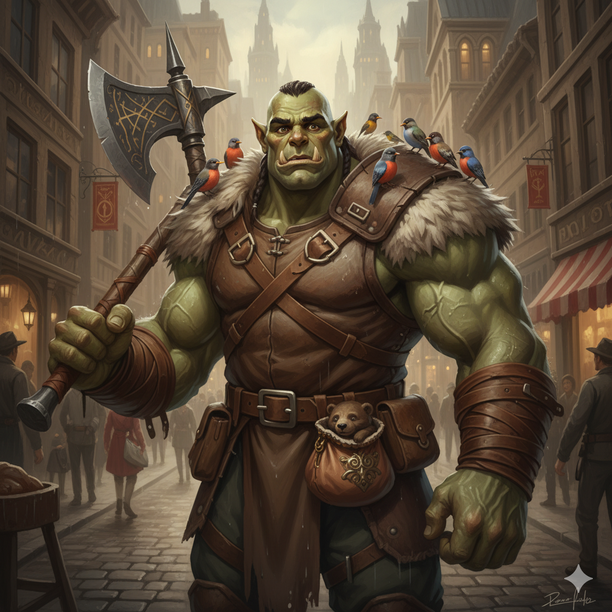

## Grog: The Gentle Giant (Level 1 Half-Orc)

### Summary & Context

| Context Element | Details |
| :--- | :--- |
| **Character Name** | **Grog** |
| **Race/Class** | **Half-Orc Barbarian (Level 1)** |
| **Alignment** | **Neutral Good** |
| **Role** | Frontline Tank, Muscle, and Protector. |
| **Motivation** | A physically intimidating but soft-hearted giant looking for a place to belong and people to protect. |

---

### The Basics & Personality

| Category | Detail |
| :--- | :--- |
| **Class Feature** | **Rage:** As a bonus action, Grog can enter a rage. While raging, he has advantage on Strength checks and saves, gets a damage bonus to melee attacks ($\mathbf{+2}$ at Lvl 1), and resistance to slashing, piercing, and bludgeoning damage. |
| **Race Feature** | **Savage Attacks:** Roll one additional weapon damage die when scoring a critical hit with a melee weapon. **Relentless Endurance:** Once per long rest, Grog drops to 1 HP instead of 0 HP. |
| **Background Feature** | **Wanderer (Outlander):** Grog has an excellent memory for maps and geography. He can accurately recall the layout of any wilderness or natural terrain he has travelled. |
| **Personality Trait**| I'm a good listener. I rarely speak unless I have something important to say, but I'm fiercely attentive to those I protect. |
| **Ideal** | **Protection.** Those who cannot defend themselves deserve to have someone stand between them and danger. |
| **Bond** | I once rescued a small, strangely ornate **bear cub** that I still carry with me in a pouch. I must keep it safe. |
| **Flaw** | I don't understand city customs or complex social rules, and I sometimes break things without meaning to. |
| **Weapons** | **Great Axe** ($\mathbf{1d12}$ Slashing, Heavy, Two-Handed), two **Handaxes** ($\mathbf{1d6}$ Slashing, Light, Thrown). |
| **Armor** | None (Relies on **Unarmored Defense**). |

---

### Core Stats & Defense

| Statistic | Value | Calculation / Notes |
| :--- | :--- | :--- |
| **Armor Class (AC)** | **13** | $10 \text{ (Base)} + 1 \text{ (DEX Mod)} + 2 \text{ (CON Mod)}$ (Unarmored Defense) |
| **Hit Points (HP)** | **14** | $12 \text{ (Barbarian Die)} + 2 \text{ (CON Mod)}$ |
| **Speed** | **30 ft.** | Base speed for a Half-Orc. |
| **Initiative** | **+1** | $+\text{DEX Modifier}$ |
| **Proficiency Bonus**| **+2** | Applies to all proficient rolls. |

---

### Ability Scores & Modifiers

| Score | Final Value | Modifier | Saving Throw | Primary Use |
| :--- | :--- | :--- | :--- | :--- |
| **STR (Strength)** | 17 | **+3** | **+5** (Proficient) | Main combat stat, crushing, lifting. |
| **CON (Constitution)** | 15 | **+2** | **+4** (Proficient) | Hit Points and resilience. |
| **DEX (Dexterity)** | 13 | **+1** | **+1** | Initiative, some AC. |
| **WIS (Wisdom)** | 12 | **+1** | **+1** | Perception and Survival checks. |
| **CHA (Charisma)** | 10 | **+0** | **+0** | Neutral social presence. |
| **INT (Intelligence)** | 8 | **-1** | **-1** | Lowest stat, not book-smart. |

---

### Proficiencies

Grog focuses on physical and natural skills, gaining proficiency in **Athletics** and **Survival** from his background.

| Skill / Saving Throw | Modifier | Source |
| :--- | :--- | :--- |
| **Athletics** | $\mathbf{+5}$ | Outlander Prof ($\text{STR + Prof}$) |
| **Survival** | $\mathbf{+3}$ | Outlander Prof ($\text{WIS + Prof}$) |
| **Animal Handling** | $+1$ | WIS Mod |
| **Intimidation** | $+0$ | CHA Mod |
| **Tools** | Musical Instrument (Horn) | $\mathbf{+2}$ | Outlander Prof |

---
