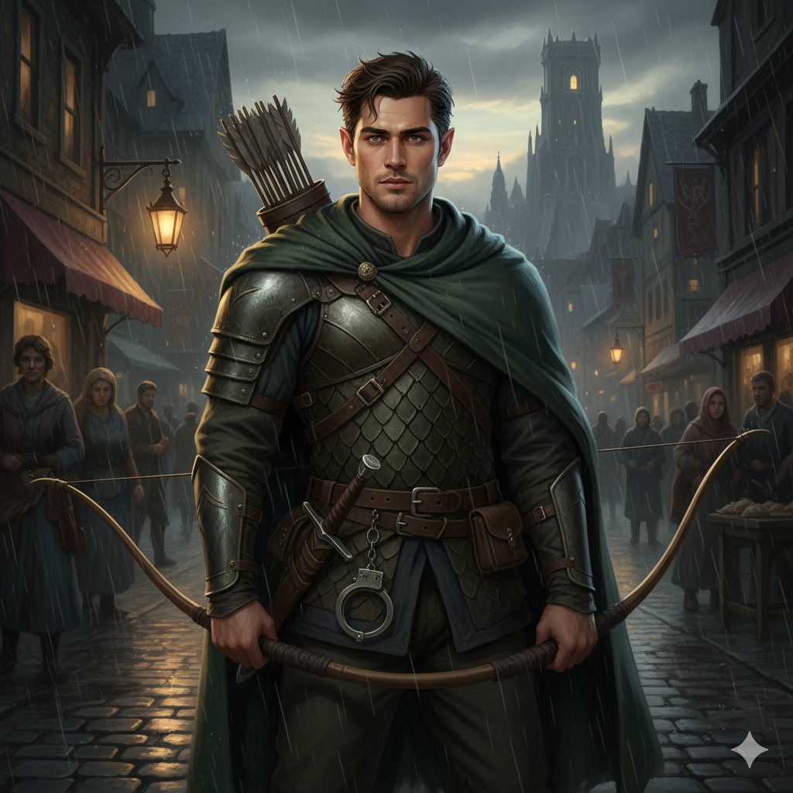

## Silas: The Clever Ranger (Level 1 Half-Elf)

### Summary & Context

| Context Element | Details |
| :--- | :--- |
| **Character Name** | **Silas** |
| **Race/Class** | **Half-Elf Ranger (Level 1)** |
| **Alignment** | **Neutral Good** |
| **Role** | Versatile Investigator, Urban Tracker, and Light Combatant. |
| **Motivation** | Seeking **Justice** for his murdered former captain in the City Watch. He believes uncovering the truth of the **Shattered Crown** plot may lead to the killer. |

### The Basics & Personality

| Category | Detail |
| :--- | :--- |
| **Class Feature** | **Favored Enemy (Humanoids: Thugs, Guards, and Trackers):** Advantage on Wisdom (Survival) checks to track and Wisdom (Insight) checks to recall information about favored enemies. |
| **Background Feature** | **Investigator:** Network of contacts among the city watch and common criminals. Can quickly find safe spots or gather rumors. |
| **Personality Trait**| I always have a plan, and I always notice when others don't. My patience is a weapon; I can wait for the perfect moment. |
| **Ideal** | **Justice.** The law is often flawed, but uncovering the truth is always worth the risk. |
| **Bond** | My previous captain in the City Watch was murdered investigating a secret society, and I owe it to them to find the killer. |
| **Flaw** | I'm extremely suspicious of anyone in a position of power and will automatically question their motives. |
| **Weapons** | **Longbow** (1d8 Piercing), **Shortsword** (1d6 Piercing), and two **Daggers**. |
| **Armor** | **Scale Mail** (Medium Armor) and a **Shield**. |

---

### Core Stats & Defense

| Statistic | Value | Calculation / Notes |
| :--- | :--- | :--- |
| **Armor Class (AC)** | **16** | 14  (Scale Mail) + 2  (DEX Mod) |
| **Hit Points (HP)** | **11** | 10  (Ranger Die) + 1  (CON Mod) |
| **Speed** | **30 ft.** | Base speed for a Half-Elf. |
| **Initiative** | **+3** | +DEX Modifier |
| **Proficiency Bonus**| **+2** | Applies to all proficient rolls. |

---

### Ability Scores & Modifiers

| Score | Final Value | Modifier | Saving Throw | Primary Use |
| :--- | :--- | :--- | :--- | :--- |
| **DEX (Dexterity)**    | 16 | **+3** | **+5** (Proficient) | Main combat stat (AC, Bows/Daggers, Initiative). |
| **WIS (Wisdom)**       | 15 | **+2** | **+2** | Spellcasting, Perception, Tracking. |
| **CHA (Charisma)**     | 15 | **+2** | **+2** | Social skills and dealing with common folk. |
| **CON (Constitution)** | 12 | **+1** | **+1** | Hit Points and resilience. |
| **INT (Intelligence)** | 10 | **+0** | **+0** | General cleverness and knowledge checks. |
| **STR (Strength)** | 8 | **-1** | **+1** (Proficient) | Lowest stat, but proficient in the save. |

---

### Proficiencies

Silas benefits from the Half-Elf's **Skill Versatility** (Persuasion and Insight) and the Ranger's focus on tracking and stealth.

| Skill / Saving Throw | Modifier | Source |
| :--- | :--- | :--- |
| **Acrobatics** | +3 | DEX Mod |
| **Athletics** | +1 | Investigator Prof (STR + Prof) |
| **Insight** | +4 | Half-Elf Versatility Prof (WIS + Prof) |
| **Investigation** | +2 | Ranger Prof (INT + Prof) |
| **Perception** | +4 | Ranger Prof (WIS + Prof) |
| **Persuasion** | +4 | Half-Elf Versatility Prof (CHA + Prof) |
| **Stealth** | +5 | Ranger Prof (DEX + Prof) |
| **Survival** | +4 | Ranger Prof (WIS + Prof) |

---

Are you ready to use this information to resolve the encounter between Trix and Silas?
